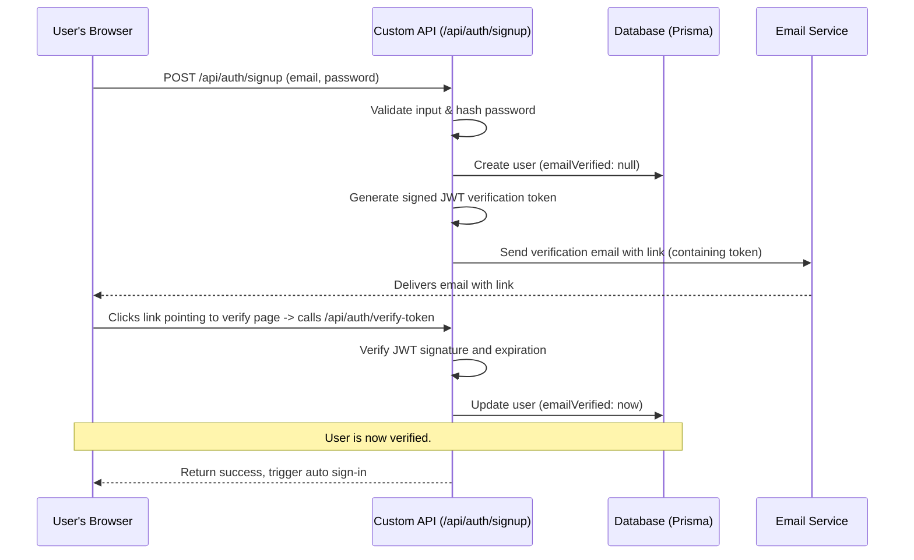
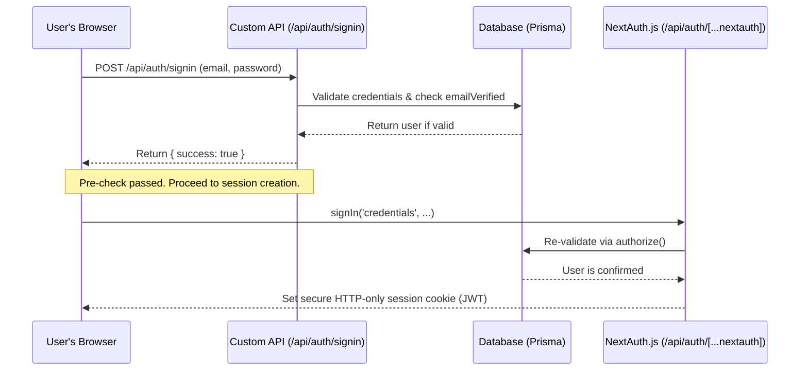

## Core Architecture: Two Systems Working Together

The authentication is not handled by a single system, but by two distinct sets of API endpoints that collaborate.

1.  **Custom API Routes (The "Pre-Checks"):** These are the endpoints you see in directories like `/src/app/api/auth/signup` and `/src/app/api/auth/signin`. Their job is to handle the initial business logic, user interaction, and validation _before_ an official session is created.
2.  **NextAuth.js (The "Official Session Manager"):** This is the core, secure session management system powered by the NextAuth.js library. It is handled by the catch-all route at `/src/app/api/auth/[...nextauth]/route.ts` and configured by `lib/auth.ts`. Its sole responsibility is to create, verify, and manage user sessions (JWTs).

## Detailed Authentication Flows

### 1. User Registration (Signup) Flow

The signup process is handled entirely by our custom API routes. NextAuth.js is not involved at this stage(It will be used later when the user logs in). We use a secure, stateless JWT-based verification flow instead of storing OTPs in the database.

**Steps:**

1.  **Submission:** The user submits their details to `/api/auth/signup`.
2.  **Validation & Creation:** The API validates the data, hashes the password, and creates a new user in the database. `emailVerified` is initially null.
3.  **Token Generation:** Instead of storing an OTP in the database, the server generates a time-limited, signed JWT containing the user's email and purpose.
4.  **Verification:** An email containing a magic link with this token is sent to the user.
5.  **Confirmation:** The user clicks the link, which triggers the `/api/auth/verify-token` endpoint. The API cryptographically verifies the token. If valid, it updates the user's `emailVerified` timestamp in the database.
6.  **Auto Sign-In:** After successful verification, the system uses the special `"auto-signin"` provider in NextAuth.js to automatically log the user in, creating a seamless experience.

### 2. User Sign-In Flow

The sign-in flow is where the two systems work together. It's a two-step process.

**Steps:**

1.  **Pre-Check:** The frontend first calls our **custom** `/api/auth/signin` route. This route performs initial checks (does the user exist? is the password correct? is the email verified?) and provides specific feedback to the UI. It **does not** create a session.
2.  **Frontend Reacts:** If the custom API returns success, the frontend knows it's safe to proceed.
3.  **Official Login:** The frontend then calls the `signIn()` function from the `next-auth/react` library.
4.  **NextAuth Takes Over:** This `signIn()` call triggers a request to the **NextAuth.js** handler (`/api/auth/[...nextauth]/route.ts`).
5.  **Final Validation:** NextAuth.js uses the configuration from `lib/auth.ts` to run its `authorize` function. This function acts as a final security gate, re-validating the credentials.
6.  **Session Creation:** Upon successful authorization, NextAuth.js generates a secure JWT, sets it as an HTTP-only cookie in the browser, and establishes the user's session.

## Key Files and Their Roles

| File | Role |
| :--- | :--- |
| `/src/app/api/auth/signup/route.ts` | Handles new user registration, hashing passwords, and triggering the verification email. |
| `/src/app/api/auth/send-verification/route.ts` | Handles generating and sending verification tokens via email. |
| `/src/app/api/auth/verify-token/route.ts` | Verifies the signed JWT token and marks the user's email as verified in the database. |
| `/src/app/api/auth/signin/route.ts` | Acts as a **pre-validation** step for the UI before handing off to NextAuth.js. |
| `/src/app/api/auth/[...nextauth]/route.ts` | The **core NextAuth.js engine**. A catch-all route that handles all official session management (`/api/auth/session`, `/api/auth/signout`, etc.). |
| `lib/auth.ts` | The **brain of NextAuth.js**. This file contains the `authOptions` configuration, defining providers, callbacks, session strategy, and the crucial `authorize` logic. |
| `prisma/schema.prisma` | Defines the database schema for the `User` model, including the critical `emailVerified` field. |
| `prisma.config.ts` | Handles the database connection configuration and client instantiation. |
