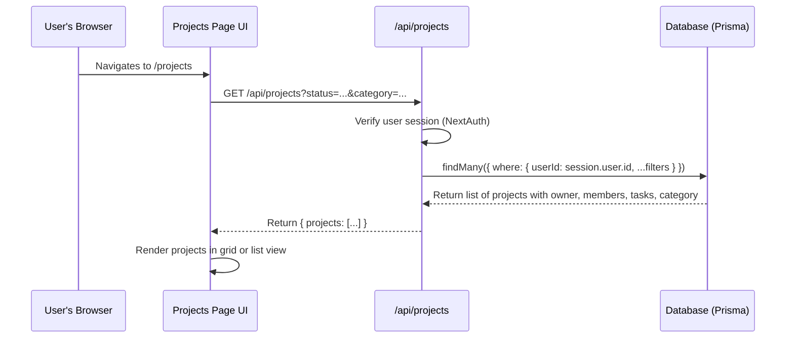
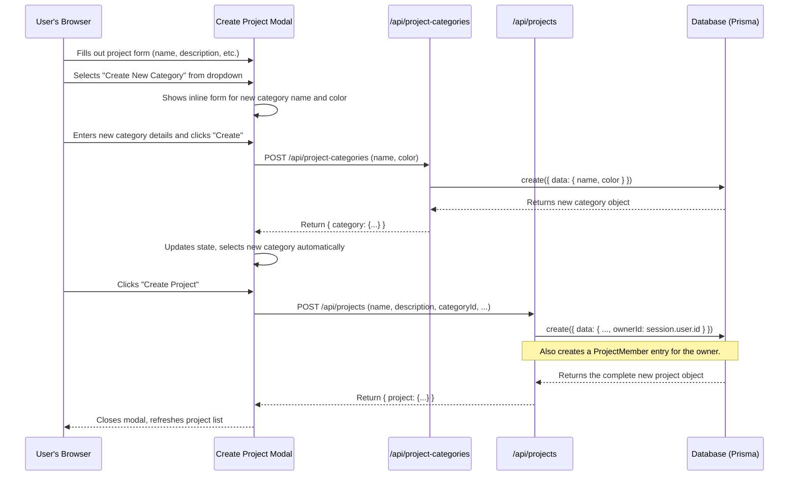
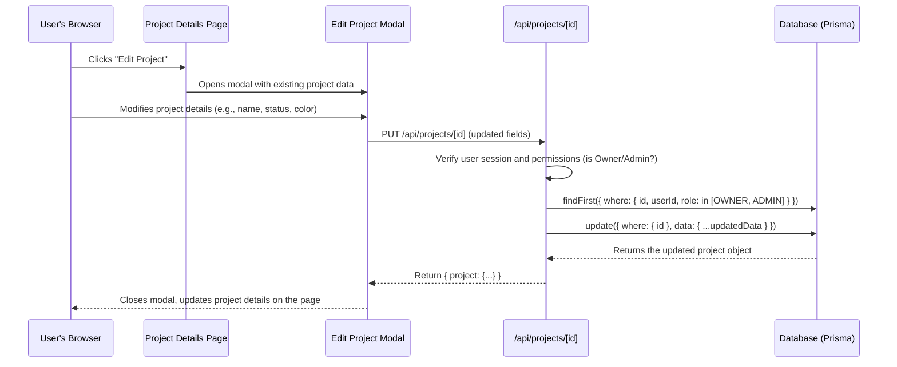
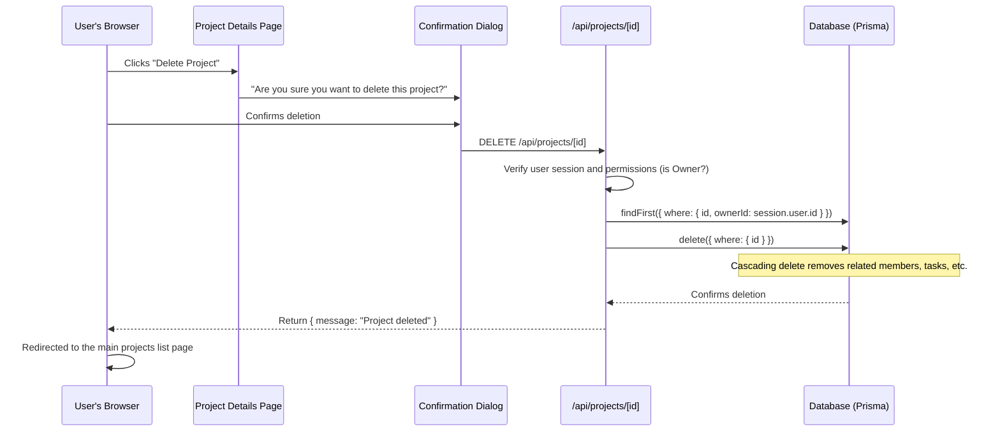

# Project Creation & Management

This document outlines the architecture and data flow for creating, viewing, updating, and deleting projects and their associated categories.

## Core Architecture

The project management system is built around a standard client-server model within the Next.js framework, consisting of three main parts:

1.  **Prisma Models:** The database schema defines the structure for `Project`, `ProjectMember`, and `Category`, establishing the relationships between them.
2.  **RESTful API Routes:** A set of API endpoints under `/src/app/api/` handles all CRUD (Create, Read, Update, Delete) operations for projects and categories. These routes are secured, ensuring only authenticated users can access or modify data.
3.  **React Frontend Components:** Client-side pages and components, located in `/src/app/projects/`, provide the user interface for interacting with the project data.

---

## Detailed Flows

### 1. Viewing All Projects

This flow describes how a user's projects are fetched and displayed.

**Steps:**

1.  **Navigation:** The user opens the `/projects` page.
2.  **Data Fetching:** The page component makes a `GET` request to `/api/projects`, including any active filters for status or category.
3.  **Authentication:** The API route verifies the user's session using NextAuth.js.
4.  **Database Query:** Prisma queries the database for all projects where the current user is either the owner or a member, applying the specified filters. It includes related data like the project owner, members, tasks, and category.
5.  **Response:** The API returns a JSON object containing the array of projects.
6.  **Rendering:** The frontend state is updated, and the projects are rendered on the screen.

### 2. Creating a New Project (with Dynamic Category Creation)

This flow shows how a new project is created, including the option to create a new category on the fly.

**Steps:**

1.  **Open Modal:** The user clicks "New Project" to open the creation modal.
2.  **Dynamic Category:**
    - The user decides the existing categories are not suitable and selects the "+ Create New Category" option.
    - An inline form appears. The user provides a name and color for the new category.
    - A `POST` request is sent to `/api/project-categories`. The API validates the data, checks for duplicates, and creates the new category in the database.
    - The new category is returned and automatically selected in the main project form.
3.  **Project Submission:** The user submits the completed project form.
4.  **API Request:** A `POST` request is sent to `/api/projects` with all project details, including the `categoryId`.
5.  **Database Creation:** The API creates the new `Project` record, automatically assigning the current user as the `owner`. It also creates an associated `ProjectMember` record, giving the owner the `OWNER` role.
6.  **Success:** The API returns the newly created project object. The frontend closes the modal and refreshes the list of projects to include the new one.

### 3. Updating a Project

This flow outlines how a user with the appropriate permissions (Owner or Admin) can update a project's details.

**Steps:**

1.  **Initiate Edit:** On the project details page (`/projects/[id]`), a user with `OWNER` or `ADMIN` role clicks the "Edit" button.
2.  **Form Population:** The "Edit Project" modal opens, pre-filled with the current project's data.
3.  **Submission:** The user modifies the desired fields and submits the form.
4.  **API Request:** A `PUT` request is sent to `/api/projects/[id]` containing only the fields that were changed.
5.  **Permission Check:** The API first verifies that the logged-in user has the necessary permissions to edit the project.
6.  **Database Update:** If permissions are valid, Prisma updates the project record in the database with the new data.
7.  **Success:** The API returns the complete, updated project object. The frontend then closes the modal and updates the UI with the new information.

### 4. Deleting a Project

This flow describes how a project owner can permanently delete a project.

**Steps:**

1.  **Initiate Deletion:** The project `OWNER` clicks the "Delete" button on the project details page.
2.  **Confirmation:** A dialog appears asking for confirmation to prevent accidental deletion.
3.  **API Request:** Upon confirmation, the frontend sends a `DELETE` request to `/api/projects/[id]`.
4.  **Ownership Verification:** The API route strictly checks if the logged-in user is the `owner` of the project. This is a critical security step.
5.  **Database Deletion:** If the user is the owner, Prisma deletes the project record. The `onDelete: Cascade` setting in the Prisma schema ensures that all related data (members, tasks, comments, etc.) is automatically deleted as well.
6.  **Success & Redirect:** The API returns a success message. The frontend then redirects the user back to the main projects list (`/projects`).

---

## Key Files and Their Roles

| File                                       | Role                                                                                                                                                                           |
| :----------------------------------------- | :----------------------------------------------------------------------------------------------------------------------------------------------------------------------------- |
| `prisma/schema.prisma`                     | Defines the `Project`, `ProjectMember`, and `Category` models and their relationships.                                                                                         |
| `prisma.config.ts`                         | Handles the database connection configuration and client instantiation.                                                                                                        |
| `/src/app/api/projects/route.ts`           | Handles `GET` requests to list all projects for a user and `POST` requests to create new projects. Includes logic for filtering.                                               |
| `/src/app/api/projects/[id]/route.ts`      | Handles `GET` (single project), `PUT` (update), and `DELETE` operations for a specific project identified by its ID.                                                           |
| `/src/app/api/project-categories/route.ts` | Handles `GET` requests to list all categories and `POST` requests to create new ones.                                                                                          |
| `/src/app/projects/page.tsx`               | The main frontend page for displaying the list of projects. It includes the UI for searching, filtering, toggling views (grid/list), and launching the "Create Project" modal. |
| `/src/app/projects/[id]/page.tsx`          | The detailed view for a single project. Displays project statistics, tasks, members, and provides options for editing or deleting the project.                                 |
| `/src/components/ProjectForm.tsx`        | Reusable form component for creating and editing projects. Handles validation and category management.                                                                         |
| `/src/components/CreateProjectModal.tsx`   | Wrapper modal that uses `ProjectForm` for creating new projects.                                                                               |
| `/src/components/EditProjectModal.tsx`     | Wrapper modal that uses `ProjectForm` for editing existing project details.                                                                                                                          |
| `docs/how-it-works/crud_project.md`        | This file. Provides a high-level overview and detailed documentation of the project management feature.                                                                        |
