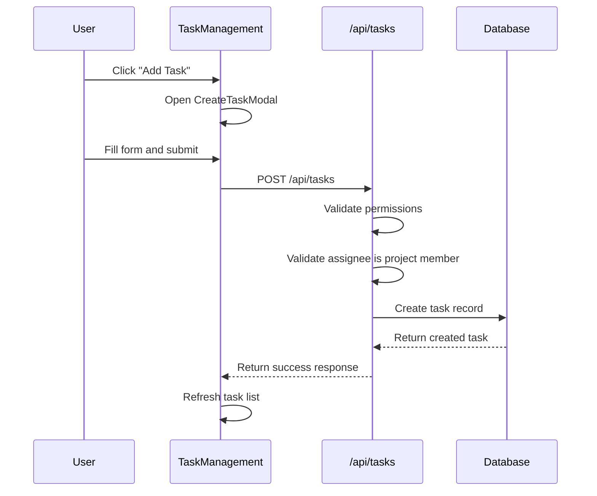
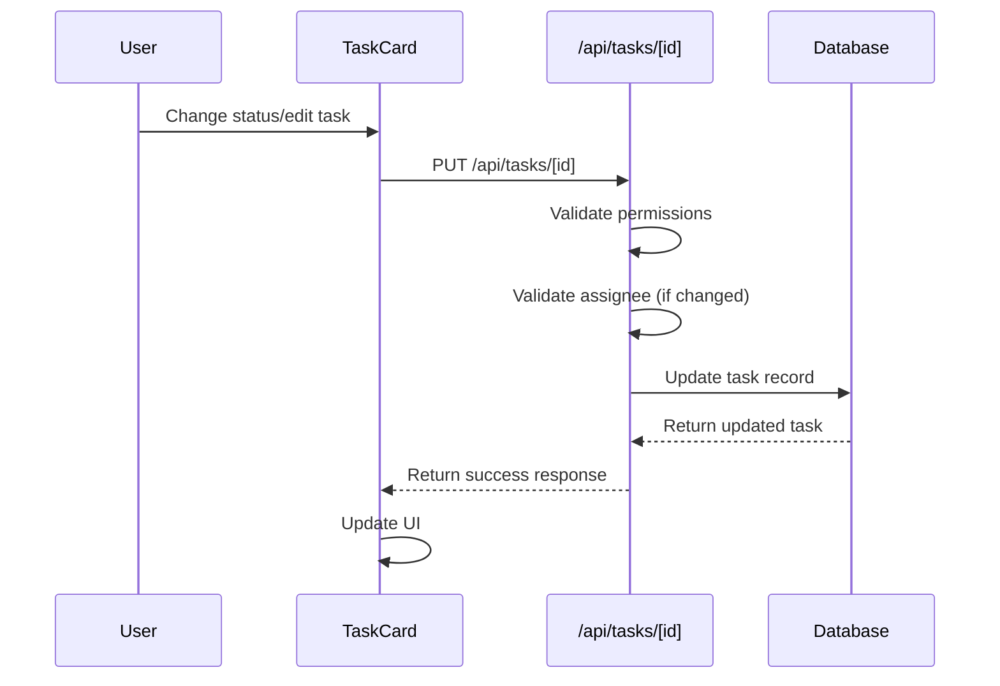

# Task Management System

This document outlines the architecture and functionality of the task management system in Prone.

## Overview

The task management system provides comprehensive CRUD operations for tasks within projects, including:

- Task creation, reading, updating, and deletion
- Task assignment to project members
- Task status tracking (To Do, In Progress, In Review, Done)
- Task priorities (Low, Medium, High, Urgent)
- Due date management
- Kanban board visualization
- Filtering and searching capabilities

## Core Components

### 1. API Routes

#### `/src/app/api/tasks/route.ts`

- **GET**: Fetch tasks for a project with optional filtering by status and assignee
- **POST**: Create new tasks with validation and permission checks

#### `/src/app/api/tasks/[id]/route.ts`

- **GET**: Fetch individual task details with related data
- **PUT**: Update task properties with validation
- **DELETE**: Remove tasks (restricted to owners and admins)

### 2. Frontend Components

#### `TaskManagement.tsx`

Main component that provides:

- Kanban board view with columns for each status
- Task filtering by status and assignee
- Create task modal
- Task card components with inline editing

#### Task Card Features

- Quick status updates via dropdown
- Priority and due date indicators
- Assignee information
- Edit and delete actions (with permission checks)
- Comment and attachment counts

## Data Flow

### Creating a Task



### Updating a Task



## Permission System

### Task Creation

- **Owner**: Can create tasks
- **Admin**: Can create tasks
- **Manager**: Can create tasks
- **Member**: Cannot create tasks
- **Viewer**: Cannot create tasks

### Task Editing

- **Owner**: Can edit all tasks
- **Admin**: Can edit all tasks
- **Manager**: Can edit all tasks
- **Member**: Cannot edit tasks
- **Viewer**: Cannot edit tasks

### Task Deletion

- **Owner**: Can delete all tasks
- **Admin**: Can delete all tasks
- **Manager**: Cannot delete tasks
- **Member**: Cannot delete tasks
- **Viewer**: Cannot delete tasks

## Task Status Workflow

```
TODO → IN_PROGRESS → IN_REVIEW → DONE
  ↑         ↓           ↓         ↓
  └─────────┴───────────┴─────────┘
```

Users can move tasks between any status, providing flexibility in workflow management.

## Priority Levels

1. **LOW** - Minor tasks or future improvements
2. **MEDIUM** - Standard tasks with normal importance
3. **HIGH** - Important tasks requiring prompt attention
4. **URGENT** - Critical tasks requiring immediate action

## Features

### Kanban Board

- Visual representation of tasks organized by status
- Drag-and-drop functionality (planned for future release)
- Quick status updates via dropdown

### Filtering

- Filter by task status
- Filter by assignee
- Collapsible filter panel

### Task Details

- Title and description
- Status and priority indicators
- Due date with calendar icon
- Assignee information with avatar
- Creation and update timestamps

### Validation

- Required fields validation
- Assignee must be project member
- Due date format validation
- Permission-based action restrictions

## Database Schema

The task system uses the existing Prisma schema with these key models:

- **Task**: Main task entity with status, priority, due dates
- **User**: Task assignees
- **Project**: Task container with member relationships
- **ProjectMember**: Defines user roles and permissions

## API Endpoints

| Method | Endpoint                    | Description        | Permission Required |
| ------ | --------------------------- | ------------------ | ------------------- |
| GET    | `/api/tasks?projectId={id}` | List project tasks | Project member      |
| POST   | `/api/tasks`                | Create new task    | Owner/Admin/Manager |
| GET    | `/api/tasks/{id}`           | Get task details   | Project member      |
| PUT    | `/api/tasks/{id}`           | Update task        | Owner/Admin/Manager |
| DELETE | `/api/tasks/{id}`           | Delete task        | Owner/Admin         |

## Integration

The task management system is integrated into the project detail page (`/projects/[id]`) and replaces the basic task list with a comprehensive management interface.

### Usage in Project Page

```tsx
<TaskManagement
  projectId={project.id}
  members={project.members}
  canCreateTasks={canEditProject()}
/>
```

## Future Enhancements

1. **Drag & Drop**: Implement task reordering and status changes via drag-and-drop
2. **Bulk Operations**: Select multiple tasks for bulk status updates or deletion
3. **Task Templates**: Predefined task templates for common project types
4. **Time Tracking**: Integration with time tracking functionality
5. **Task Dependencies**: Link tasks with dependencies and prerequisites
6. **Custom Fields**: Allow projects to define custom task fields
7. **Advanced Filtering**: Date range filters, custom field filters
8. **Task Comments**: Inline commenting system for task discussions
9. **File Attachments**: Attach files and documents to tasks
10. **Notifications**: Real-time notifications for task assignments and updates
