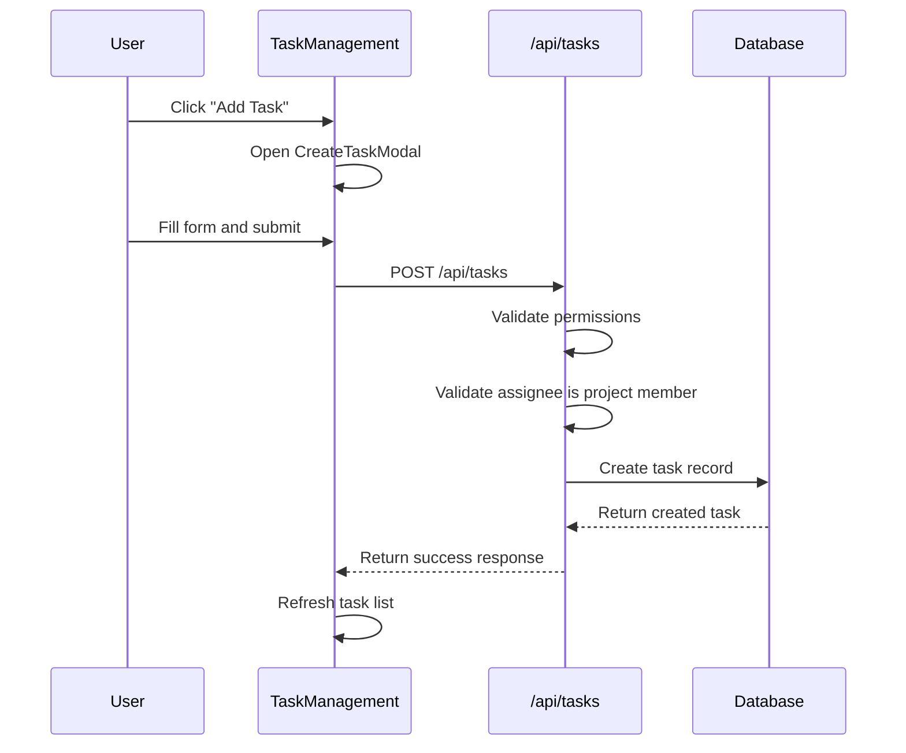
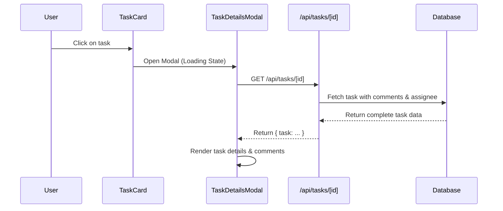
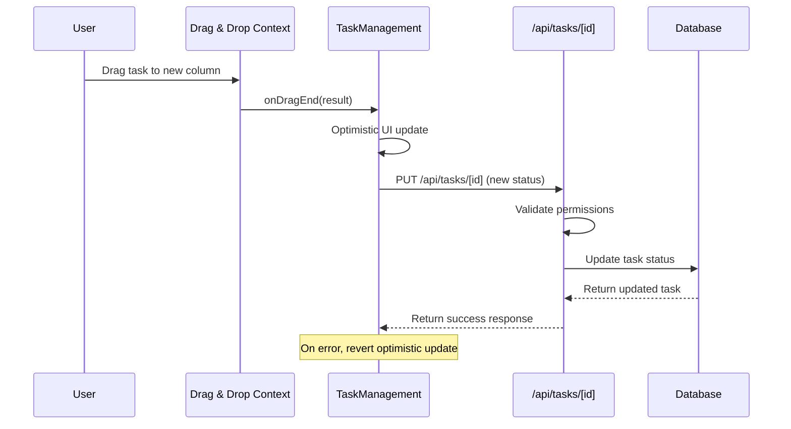
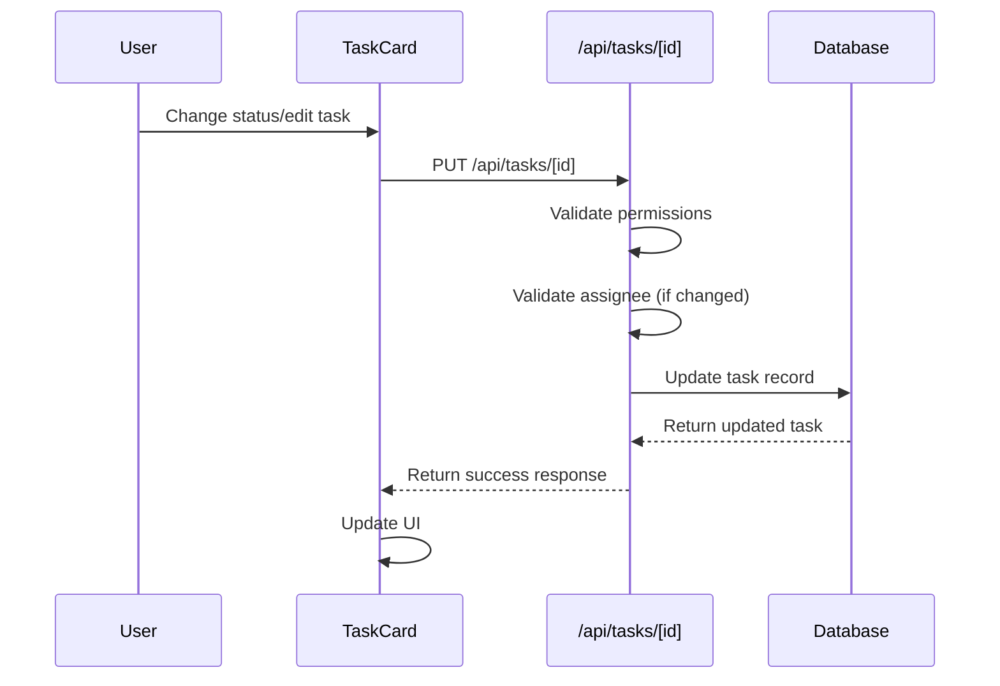

# Task Management System

This document outlines the architecture and functionality of the task management system in Prone.

## Overview

The task management system provides comprehensive CRUD operations for tasks within projects, including:

- Task creation, reading, updating, and deletion
- Task assignment to project members
- Task status tracking (To Do, In Progress, In Review, Done)
- Task priorities (Low, Medium, High, Urgent)
- Due date management
- Kanban board visualization
- Filtering and searching capabilities

## Core Components

### 1. API Routes

#### `/src/app/api/tasks/route.ts`

- **GET**: Fetch tasks for a project with optional filtering by status and assignee
- **POST**: Create new tasks with validation and permission checks

#### `/src/app/api/tasks/[id]/route.ts`

- **GET**: Fetch individual task details with related data
- **PUT**: Update task properties with validation
- **DELETE**: Remove tasks (restricted to owners and admins)

### 2. Frontend Components

#### `TaskManagement.tsx`

The main orchestrator component that manages the state and layout of the task system:

- **State Management**: Handles optimistic updates, drag-and-drop logic, and filter state
- **Component Composition**: Orchestrates the `TaskCard`, `CreateTaskModal`, and `EditTaskModal` components
- **Layouts**: Renders the Kanban board with drag-and-drop zones
- **Responsive Design**: Adapts layout for mobile and desktop views

#### `TaskCard.tsx`

A reusable component representing a single task card in the board:

- **Drag Handle**: Visual grip icon for intuitive drag-and-drop
- **Priority Indicators**: Color-coded badges with emoji indicators
- **Due Date Management**: Calendar display with overdue warnings
- **Assignee Display**: User avatars with fallback initials
- **Task Metadata**: Comment counts and other key metrics
- **Action Menu**: Context menu for Edit and Delete actions
- **Visual States**: Hover effects, dragging states, and smooth transitions

#### `TaskForm.tsx`
Reusable form component that handles all task data entry logic:

- **Unified Logic**: Handles state, validation, and submission for both creating and editing tasks
- **Rich Input**: Support for due dates, priority selection, and assignee assignment
- **Styling**: Consistent usage of UI components (Input, Select, Textarea)

#### `CreateTaskModal.tsx` & `EditTaskModal.tsx`

Lightweight wrapper components:

- **Dialog Integration**: Wraps `TaskForm` in a standardized `Dialog` component
- **Context Awareness**: Passes specific props (like `projectId` or existing `task` data) to the form
- **Lifecycle Management**: Handles open/close states and refresh triggers on success

#### `TaskDetailsModal.tsx`

A focused modal component for viewing and interacting with a single task:

- **Detailed View**: Shows full task title, description, and metadata
- **Comments System**: Integrated commenting with realtime updates and user attribution
- **Sidebar Layout**: Dedicated space for metadata (Assignee, Due Date, Priority, Status)
- **Minimalist Design**: Clean, centered layout with translucent backdrop (glassmorphism)
- **Status Badges**: Visual indicators for status and priority

## Data Flow

### Creating a Task



### Viewing Task Details



### Updating a Task via Drag & Drop



### Updating a Task via Edit Modal



## Permission System

### Task Creation

- **Owner**: Can create tasks
- **Admin**: Can create tasks
- **Member**: Can create tasks
- **Viewer**: Cannot create tasks

### Task Editing

- **Owner**: Can edit all tasks
- **Admin**: Can edit all tasks
- **Member**: Can edit tasks
- **Viewer**: Cannot edit tasks

### Task Deletion

- **Owner**: Can delete all tasks
- **Admin**: Can delete all tasks
- **Member**: Cannot delete tasks
- **Viewer**: Cannot delete tasks

## Task Status Workflow

```
TODO → IN_PROGRESS → IN_REVIEW → DONE
  ↑         ↓           ↓         ↓
  └─────────┴───────────┴─────────┘
```

Users can move tasks between any status, providing flexibility in workflow management.

## Priority Levels

1. **LOW** - Minor tasks or future improvements
2. **MEDIUM** - Standard tasks with normal importance
3. **HIGH** - Important tasks requiring prompt attention
4. **URGENT** - Critical tasks requiring immediate action

## Features

### Kanban Board

- **Visual Task Organization**: Tasks are organized in four status-based columns: To Do, In Progress, In Review, and Done
- **Drag-and-Drop Functionality**: Seamless task status updates by dragging tasks between columns using @hello-pangea/dnd
- **Column Design**: Each column has distinct colors and icons for easy visual differentiation
- **Real-time Updates**: Optimistic UI updates with server synchronization
- **Drop Zones**: Visual feedback during drag operations with highlighted drop zones
- **Task Counts**: Dynamic task counts displayed in column headers
- **Responsive Layout**: Adapts from single column on mobile to four columns on desktop

### Enhanced Task Cards 
- **Drag Handle**: Visual grip icon for intuitive drag-and-drop interaction
- **Priority Indicators**: Color-coded priority badges 
- **Due Date Tracking**: Calendar icons with overdue warnings and visual indicators
- **Assignee Information**: User avatars and names with fallback initials
- **Task Metadata**: Comments count display
- **Overdue Alerts**: Red styling and warning icons for overdue tasks
- **Hover Effects**: Smooth transitions and shadow effects for better interactivity
- **Action Menu**: Edit and delete options accessible via dropdown menu

### Task Details Modal
- **Rich Content**: Displays full title, description, and metadata
- **Comments**: Integrated commenting system for task discussions
- **Design**: Modern, glassmorphism-inspired translucent UI
- **Navigation**: Easy close with standardized left-side button or backdrop click

### Filtering

- Filter by task status
- Filter by assignee
- Collapsible filter panel

### User Experience

- **Loading States**: Skeleton loading for better perceived performance
- **Error Handling**: User-friendly error messages with retry mechanisms
- **Empty States**: Helpful guidance when no tasks exist
- **Responsive Design**: Mobile-first design that works on all screen sizes
- **Accessibility**: Keyboard navigation and screen reader support
- **Visual Feedback**: Smooth animations and transitions throughout the interface

### Task Details

- Title and description
- Status and priority indicators
- Due date with calendar icon
- Assignee information with avatar
- Creation and update timestamps
- Nested Comments with author bio

### Validation

- Required fields validation
- Assignee must be project member
- Due date format validation
- Permission-based action restrictions

## Database Schema

The task system uses the existing Prisma schema with these key models:

- **Task**: Main task entity with status, priority, due dates
- **User**: Task assignees
- **Project**: Task container with member relationships
- **ProjectMember**: Defines user roles and permissions
- **Comment**: Associated comments for task discussions

## API Endpoints

| Method | Endpoint                    | Description        | Permission Required |
| ------ | --------------------------- | ------------------ | ------------------- |
| GET    | `/api/tasks?projectId={id}` | List project tasks | Project member      |
| POST   | `/api/tasks`                | Create new task    | Owner/Admin/Member  |
| GET    | `/api/tasks/{id}`           | Get task details & comments | Project member      |
| PUT    | `/api/tasks/{id}`           | Update task        | Owner/Admin/Member  |
| DELETE | `/api/tasks/{id}`           | Delete task        | Owner/Admin         |

## Integration

The task management system is integrated into the project detail page (`/projects/[id]`) and replaces the basic task list with a comprehensive management interface.

### Usage in Project Page

```tsx
<TaskManagement
  projectId={project.id}
  members={project.members}
  canCreateTasks={canEditProject()}
/>
```

## Future Enhancements

1. **Bulk Operations**: Select multiple tasks for bulk status updates or deletion
2. **Task Templates**: Predefined task templates for common project types
3. **Time Tracking**: Integration with time tracking functionality
4. **Task Dependencies**: Link tasks with dependencies and prerequisites
5. **Custom Fields**: Allow projects to define custom task fields
6. **Advanced Filtering**: Date range filters, custom field filters
7. **File Attachments**: Attach files and documents to tasks
8. **Notifications**: Real-time notifications for task assignments and updates
9. **Board Customization**: Custom column creation and board layouts
10. **Task Archiving**: Archive completed tasks while maintaining history
11. **Keyboard Shortcuts**: Power user keyboard shortcuts for common actions
